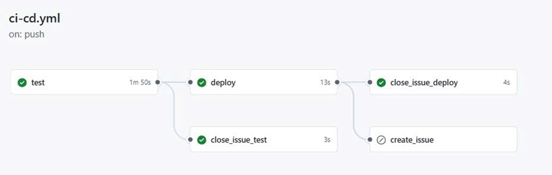
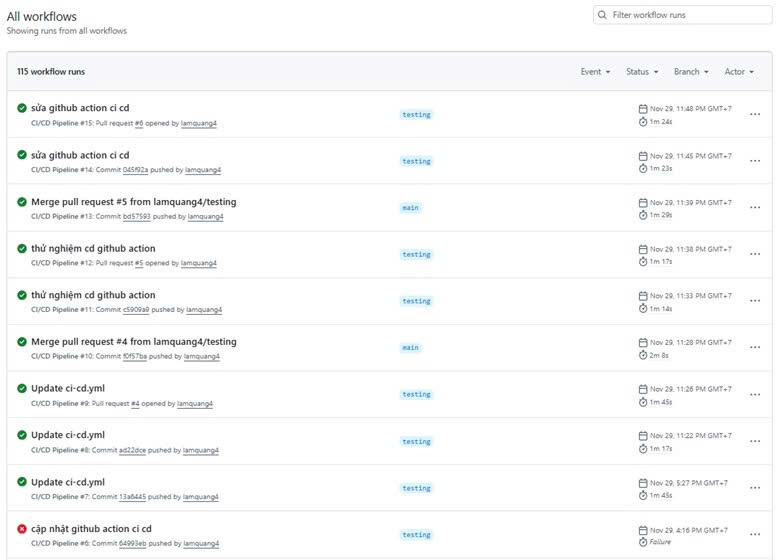
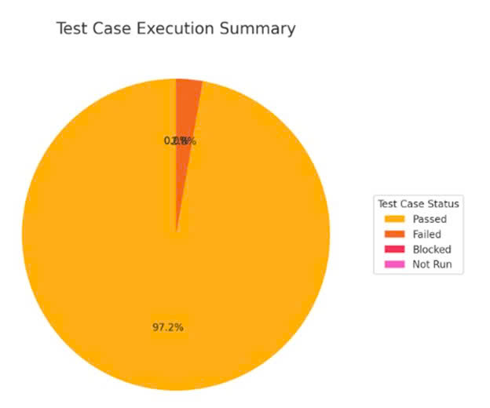
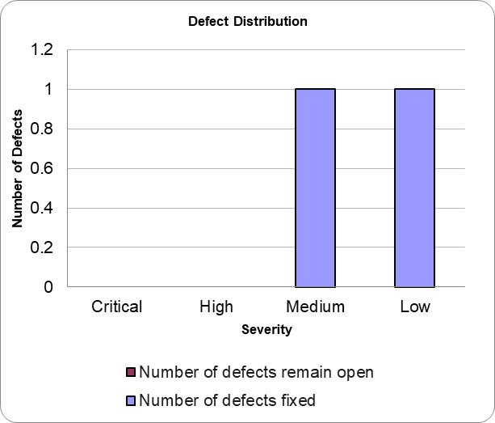
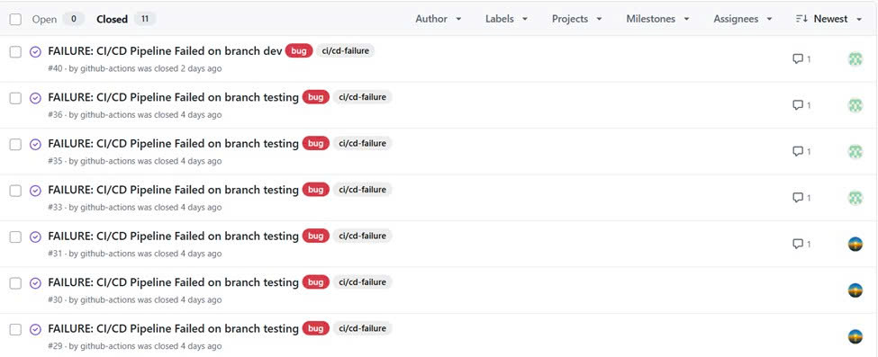

# Website fullstack Fahasa

## Cài đặt môi trường

**1. Clone repository**

```
git clone https://github.com/lamquang4/fullstack-vitejs-books.git
```

**2. Chạy website bằng Docker**

```
docker compose up --build
```

## Mục lục

[1. Giới thiệu phần mềm](#1-giới-thiệu-phần-mềm)

&nbsp;&nbsp;[1.1. Tổng quan dự án](#11-tổng-quan-dự-án)

&nbsp;&nbsp;[1.2. Công nghệ sử dụng](#12-công-nghệ-sử-dụng)

&nbsp;&nbsp;[1.3. Thiết kế phần mềm](#13-thiết-kế-phần-mềm)

&nbsp;&nbsp;[1.4. Thiết kế kiến trúc](#3-thiết-kế-kiến-trúc)

[2. Kế hoạch kiểm thử](#2-kế-hoạch-kiểm-thử)

&nbsp;&nbsp;[2.1. Hạng mục được kiểm thử](#21-hạng-mục-được-kiểm-thử)

&nbsp;&nbsp;[2.2. Chiến lược kiểm thử](#22-chiến-lược-kiểm-thử)

[3. Thiết kế kiểm thử](#3-thiết-kế-kiểm-thử)

&nbsp;&nbsp;[3.1. Quy trình thiết kế kiểm thử theo V-Model](#31-quy-trình-thiết-kế-kiểm-thử-theo-v-model)

&nbsp;&nbsp;[3.2. Kỹ thuật thiết kế kiểm thử](#32-kỹ-thuật-thiết-kế-kiểm-thử)

&nbsp;&nbsp;[3.3. Phương pháp thiết kế kiểm thử](#33-phương-pháp-thiết-kế-kiểm-thử)

[4. Báo cáo kiểm thử](#4-báo-cáo-kiểm-thử)

&nbsp;&nbsp;[4.1. Báo cáo trường hợp kiểm thử](#41-báo-cáo-trường-hợp-kiểm-thử)

&nbsp;&nbsp;[4.2. Báo cáo lỗi](#42-báo-cáo-lỗi)

## 1. Giới thiệu phần mềm

### 1.1. Tổng quan dự án

Dự án “Website thương mại điện tử Fahasa” là một hệ thống bán sách giấy trực tuyến được xây dựng nhằm mô phỏng hoạt động của một nền tảng thương mại điện tử thực tế.

Để đảm bảo chất lượng phần mềm, quá trình kiểm thử website phải được thực hiện. Kiểm thử giúp đánh giá tính đúng đắn của dữ liệu, mức độ ổn định của hệ thống, khả năng xử lý yêu cầu, tính bảo mật và hiệu năng khi hoạt động trong môi trường thực. Các hoạt động kiểm thử bao gồm xây dựng và thực hiện các test case, kiểm thử đơn vị, kiểm thử tích hợp, kiểm thử hệ thống và kiểm thử chấp nhận trước khi triển khai thực tế.

### 1.2. Công nghệ sử dụng

| Danh mục       | Tools / Frameworks                                           |
| -------------- | ------------------------------------------------------------ |
| Frontend       | Vite, ReactJS, TypeScript                                    |
| Backend        | Spring Boot, Maven                                           |
| Database       | MySQL                                                        |
| Authentication | Spring Security, JWT                                         |
| Testing        | JUnit, Mockito, Spring Boot Test, MockMvc, H2, Selenium, K6  |
| CI/CD          | GitHub Actions                                               |
| Deployment     | Render deploy Frotnend và Backend, Aiven host Database MySQL |

### 1.3. Thiết kế phần mềm

### 1.3.1. Bối cảnh kinh doanh

Với quản lý sản phẩm, khách hàng có thể tìm kiếm và sắp xếp các đầu sách theo các tiêu chí tên sách, tác giả, nhà xuất bản và danh mục. Khi nhấp vào một cuốn sách bất kỳ, khách hàng sẽ được chuyển đến trang chi tiết sản phẩm, nơi hiển thị đầy đủ thông tin gồm tên sách, tác giả, nhà xuất bản, mô tả nội dung, thông tin chi tiết, cùng hình ảnh minh họa của sách.

Quản trị viên hệ thống hoặc nhân viên bán hàng có thể thêm, sửa, xóa sách cũng như quản lý tác giả, danh mục và nhà xuất bản.

Với quản lý giỏ hàng, khách hàng cần phải đăng nhập mới có thể thêm bất kỳ cuốn sách nào vào giỏ hàng trong trang chi tiết sách. Sau khi thêm, khách hàng có thể xem toàn bộ danh sách sách trong giỏ, bao gồm tên sách, giá, giảm giá và số lượng. Hệ thống cho phép khách hàng thay đổi số lượng hoặc xóa sách khỏi giỏ hàng, đồng thời tự động cập nhật tổng tiền sau mỗi thao tác.

Với quản lý đơn hàng, khách hàng chọn đặt hàng, hệ thống sẽ tự động tạo đơn hàng, ghi nhận thông tin sản phẩm, thông tin giao hàng, phương thức thanh toán.

Quản trị viên hệ thống và nhân viên bán hàng có thể theo dõi và cập nhật trang thái đơn hàng. Nếu đơn hàng có phương thức thanh toán là Momo bị hủy hoặc trả hàng, hệ thống sẽ tự động hoàn tiền cho khách hàng.

Với quản lý thanh toán, hệ thống hỗ thanh toán khi nhận hàng và thanh toán trực tuyến qua cổng Momo. Sau khi thanh toán thành công, hệ thống ghi nhận giao dịch, cập nhật trạng thái đơn hàng, tự động trừ số lượng sách hiện có tương ứng với số lượng đặt mua và chuyển khách hàng đến trang thông báo đặt hàng thành công. Trong trường hợp thanh toán thành công nhưng số lượng sách không đủ để đáp ứng đơn hàng, hệ thống sẽ tự động hoàn tiền và chuyển khách hàng đến trang thông báo đặt hàng thất bại.
Quản trị viên hệ thống và nhân viên bán hàng có thể theo dõi, tra cứu các giao dịch thanh toán thành công hoặc hoàn tiền.

Với quản lý sổ địa chỉ, khách hàng có thể lưu trữ nhiều địa chỉ giao hàng hoặc có thể nhập thông tin địa chỉ trực tiếp trong quá trình thanh toán. Hệ thống cho phép người dùng thêm, sửa hoặc xóa địa chỉ để thuận tiện cho các lần đặt hàng.

Với kiểm soát truy cập, hệ thống cung cấp chức năng đăng nhập, đăng xuất và quản lý người dùng. Quản trị viên hệ thống có thể thêm, sửa, xóa hoặc khóa tài khoản các người dùng. Đảm bảo phân quyền rõ ràng, chỉ cho phép người dùng thực hiện các hành động phù hợp với chức vụ của họ.

### 1.3.2. Quy trình nghiệp vụ

**Quy trình xử lý giỏ hàng**


**Quy trình đặt hàng và thanh toán**


**Quy trình quản trị hệ thống**


### 1.3.3. Use case

**Use case summary**


**UC1 Quản lý sản phẩm**


**UC2 Quản lý giỏ hàng**


**UC3 Quản lý đơn hàng**


**UC4 Quản lý thanh toán**


**UC5 Quản lý sổ địa chỉ**


**UC6 Kiểm soát truy cập**


### 1.3.4. Domain driven design

**Mô tả miền nghiệp vụ**

Những lý do chính để chọn miền nghiệp vụ này:

1. Đã có hệ thống thực tế cho miền nghiệp vụ này, vì vậy mọi người có thể đối chiếu phần triển khai với một trang web đang hoạt động.

2. Miền nghiệp vụ cũng không quá đơn giản, vẫn có một số nghiệp vụ phức tạp và logic, không đơn thuần là các thao tác CRUD.

3. Miền nghiệp vụ không quá phức tạp nên dễ hiểu và không quá lớn và dễ triển khai.

Sản phẩm có các thực thể chính gồm Sách, Tác giả, Danh mục và Nhà xuất bản. Khách hàng có thể xem, tìm kiếm và lọc danh sách Sách. Quản trị viên hệ thống và nhân viên bán hàng có thể CRUD đối với Sách, Danh mục, Tác giả và Nhà xuất bản.

Giỏ hàng chỉ khách hàng đã đăng nhập mới có thể thêm Sách vào Giỏ hàng. Khách hàng có thể xem lại, thay đổi số lượng hoặc xóa sách khỏi Giỏ hàng và sau đó tiến hành đặt hàng và thanh toán.

Đơn hàng có thực thể chính là Đơn hàng và Chi tiết đơn hàng. Sau khi đã thêm sản phẩm vào giỏ hàng, khách hàng nhập thông tin giao hàng và phương thức thanh toán sẽ tạo đơn hàng. Quản trị viên hệ thống và nhân viên bán hàng có thể cập nhật trạng thái Đơn hàng.

Thanh toán có thực thể chính là Thanh toán, Phương thức thanh toán, Tình trạng thanh toán. Khách hàng có thể lựa chọn thanh toán bằng Momo. Quản trị viên hệ thống và nhân viên bán hàng có thể xem danh sách các giao dịch Thanh toán.

Sổ địa chỉ có thưc thể chính là Địa chỉ. Khách hàng có thể thêm, sửa hoặc xóa Địa chỉ.

Kiểm soát truy cập có thực thể chính là Người dùng và Chức vụ. Người dùng gồm Khách hàng, Quản trị viên hệ thống và Nhân viên bán hàng. Mỗi người dùng có thể đăng nhập vào hệ thống, đăng xuất khỏi hệ thống. Quản trị viên hệ thống có quyền quản lý các tài khoản người dùng.

**Mô hình khái niệm**


### 1.3.5. Data model

**Mô hình thực thể kết hợp mức khái niệm**


**Mô hình thực thể kết hợp mức logic**


**Mô hình thực thể kết hợp mức vật lý**


### 1.4. Thiết kế kiến trúc

### 1.4.1. Sơ đồ khối


### 1.4.2. Kiến trúc C4

**C1 - System context**


**C2 – Container**


**C3 – Component (high-level)**


**C4 – Code**

**Sơ đồ lớp**


**Sơ đồ sequence**

**Quản lý sản phẩm**


**Quản lý giỏ hàng**


**Quản lý thanh toán**


**Quản lý đơn hàng**


**Quản lý sổ địa chỉ**


**Kiểm soát truy cập**


### 1.4.3. Sơ đồ triển khai


## 2. Kế hoạch kiểm thử

### 2.1. Hạng mục được kiểm thử

### 2.1.1. Chức năng

**Kiểm soát truy cập**

- Xác minh rằng hệ thống cho phép đăng nhập cho chức vụ là khách hàng, quản trị viên.

- Xác minh rằng hệ thống cho phép đăng ký tài khoản cho khách hàng.

- Xác minh rằng hệ thống cho phép đăng xuất đối với tất cả người dùng đã đăng nhập.

- Xác minh rằng hệ thống thực thi phân quyền truy cập đúng, chỉ cho phép người dùng truy cập các chức năng phù hợp với vai trò của mình.

- Xác minh rằng hệ thống cho phép quản trị viên thực hiện quản lý người dùng với các thao tác CRUD.

**Quản lý sản phẩm**

- Xác minh rằng hệ thống cung cấp các thao tác CRUD chức năng quản lý sản phẩm cho quản trị viên.

- Xác minh rằng hệ thống hỗ trợ quản lý liên quan đến sản phẩm, bao gồm danh mục, tác giả và nhà xuất bản.

- Xác minh rằng hệ thống cho phép khách hàng truy cập và xem danh sách sản phẩm.

- Xác minh rằng hệ thống hỗ trợ các chức năng tìm kiếm, lọc và sắp xếp sản phẩm nhằm giúp khách hàng dễ dàng tìm kiếm sản phẩm mong muốn.

- Xác minh rằng hệ thống đảm bảo tính nhất quán và chính xác của dữ liệu sản phẩm giữa giao diện người dùng và hệ thống backend.

**Quản lý giỏ hàng**

- Xác minh rằng hệ thống cung cấp các thao tác CRUD chức năng quản lý giỏ hàng cho khách hàng.

- Xác minh rằng hệ thống tự động cập nhật và hiển thị chính xác thông tin giỏ hàng, bao gồm danh sách sản phẩm, số lượng và tổng tiền.

- Xác minh rằng hệ thống đảm bảo tính nhất quán dữ liệu giỏ hàng trong suốt quá trình người dùng thao tác và chuyển đổi giữa các trang.

- Xác minh rằng hệ thống có các ràng buộc nghiệp vụ đối với giỏ hàng giới hạn số lượng mua một sản phẩm theo số lượng hiện có.

- Xác minh rằng hệ thống cho phép khách hàng tiếp tục quy trình mua hàng từ giỏ hàng để chuyển sang bước đặt hàng.

**Quản lý đơn hàng**

- Xác minh rằng hệ thống cung cấp đầy đủ quản lý đơn hàng cho khách hàng, bao gồm đặt hàng, xem danh sách đơn hàng và xem chi tiết đơn hàng đã đặt.

- Xác minh rằng hệ thống cung cấp đầy đủ các chức năng quản lý đơn hàng cho quản trị viên, bao gồm xem danh sách, tìm kiếm, lọc và cập nhật trạng thái đơn hàng.

- Xác minh rằng hệ thống hỗ trợ quy trình xử lý đơn hàng theo đúng nghiệp vụ, từ lúc tạo đơn hàng đến khi hoàn tất hoặc hủy đơn.

- Xác minh rằng hệ thống đảm bảo tính chính xác và nhất quán của dữ liệu đơn hàng, bao gồm trạng thái đơn hàng, thông tin sản phẩm và tổng tiền.

**Quản lý thanh toán**

- Xác minh rằng hệ thống cung cấp đầy đủ các phương thức thanh toán cho khách hàng, bao gồm thanh toán khi nhận hàng và thanh toán qua cổng Momo.

- Xác minh rằng hệ thống hỗ trợ quy trình thanh toán Momo.

- Xác minh rằng hệ thống xử lý chính xác kết quả thanh toán từ Momo, bao gồm các trường hợp thanh toán thành công, hủy giao dịch và giao dịch hết hạn.

- Xác minh rằng hệ thống xử lý đúng các tình huống lỗi trong quá trình thanh toán.

- Xác minh rằng hệ thống đảm bảo tính nhất quán và chính xác của dữ liệu thanh toán và đơn hàng.

- Xác minh rằng hệ thống cho phép quản trị viên xem danh sách các giao dịch thanh toán Momo.

**Quản lý sổ địa chỉ**

- Xác minh rằng hệ thống cung cấp các thao tác CRUD chức năng quản lý sổ địa chỉ cho khách hàng.

- Xác minh rằng hệ thống kiểm tra và hiển thị thông báo lỗi khi khách hàng nhập thiếu hoặc nhập sai thông tin bắt buộc.

- Xác minh rằng hệ thống cho phép Khách hàng chọn địa chỉ đã lưu khi thực hiện đặt hàng và tự động điền thông tin giao hàng tương ứng.

### 2.1.2. Khả năng sử dụng

Xác minh rằng hệ thống cung cấp thanh điều hướng rõ ràng, cho phép người dùng truy cập các trang chính như trang chủ, danh sách sản phẩm, giỏ hàng và đơn hàng.

Xác minh rằng người dùng có thể dễ dàng quay lại trang trước hoặc trang chủ trong quá trình sử dụng.

Xác minh rằng các nút chức năng chính được hiển thị rõ ràng và dễ thao tác.

### 2.1.3. Tương thích

Xác minh rằng giao diện website hiển thị đúng và đồng nhất trên các trình duyệt phổ biến như Chrome, Firefox, Safari.

Xác minh rằng hệ thống tự động điều chỉnh giao diện để phù hợp với các kích thước màn hình khác nhau (Desktop, Tablet, Mobile).

Xác minh rằng các thành phần giao diện không bị vỡ hoặc lệch khi thay đổi kích thước màn hình.

Xác minh rằng người dùng có thể thao tác đầy đủ các chức năng trên các thiết bị khác nhau.

### 2.1.4. Giao diện

Xác minh rằng các màu sắc, font chữ và kiểu hiển thị đúng theo thiết kế.

Xác minh rằng logo, hình ảnh, icon được hiển thị đúng vị trí và không bị biến dạng.

Xác minh rằng các thông báo lỗi, cảnh báo, hoặc thông tin trạng thái hiển thị đúng theo ngữ cảnh nghiệp vụ.

### 2.1.5. Bảo mật

Xác minh rằng hệ thống mã hóa mật khẩu người dùng.

Xác minh rằng hệ thống kiểm soát truy cập đúng vai trò và không cho phép truy cập trái phép.

Xác minh rằng các yêu cầu HTTP/HTTPS được bảo mật, và dữ liệu không bị lộ qua URL.

Xác minh rằng hệ thống chống được các tấn công phổ biến như SQL Injection, CSRF.

Xác minh rằng các phiên đăng nhập tự động hết hạn sau thời gian quy định hoặc khi người dùng đăng xuất.

### 2.1.6. Cơ sở dữ liệu

Xác minh rằng các thao tác CRUD trên hệ thống được phản ánh đúng trong cơ sở dữ liệu.

Xác minh rằng dữ liệu được lưu trữ với định dạng và kiểu dữ liệu đúng.
Xác minh rằng các mối quan hệ giữa bảng dữ liệu được duy trì chính xác (FK, PK, ràng buộc).

Xác minh rằng các truy vấn tìm kiếm, lọc và báo cáo dữ liệu trả kết quả đúng và nhanh chóng.

### 2.1.7. Hiệu năng

Xác minh rằng hệ thống đáp ứng nhanh khi tải bình thường.

Xác minh rằng hệ thống vẫn hoạt động ổn định khi có nhiều người dùng truy cập đồng thời (load testing).

Xác minh rằng hệ thống có thể chịu được tải cực đại mà không bị crash (stress testing).

### 2.1.8. Đám đông

Xác minh rằng hệ thống được thử nghiệm trên nhiều loại thiết bị và trình duyệt khác nhau thông qua các nhóm tester khác.

Xác minh rằng người dùng thực tế có thể thao tác đầy đủ các chức năng mà không gặp lỗi nghiêm trọng.

Xác minh rằng hệ thống hoạt động ổn định và nhất quán trên các môi trường thử nghiệm đa dạng.

### 2.1.9. Hồi quy

Xác minh rằng các chức năng hiện có của hệ thống vẫn hoạt động đúng sau khi có thay đổi.

Xác minh rằng các endpoint API, giao diện UI, cơ sở dữ liệu và các quy trình nghiệp vụ vẫn tương thích và chính xác.

Xác minh rằng các luồng nghiệp vụ chính vẫn chạy ổn định.

### 2.1.10. API

Xác minh rằng các endpoint API hoạt động đúng chức năng theo thiết kế.
Xác minh rằng dữ liệu trả về từ API chính xác, đầy đủ và tuân theo định dạng yêu cầu.

Xác minh rằng quyền truy cập và bảo mật của các API được đảm bảo, người dùng không được phép truy cập trái phép.
Xác minh rằng các API tương tác đúng với cơ sở dữ liệu, giao diện UI và các endpoint liên quan khác.

Xác minh rằng các luồng nghiệp vụ chính thông qua API vẫn chạy ổn định sau khi có thay đổi hệ thống.

### 2.2. Chiến lược kiểm thử

### 2.2.1. Phương pháp kiểm thử

Dự án áp dụng mô hình V-Model trong kiểm thử phần mềm, trong đó các hoạt động kiểm thử được thực hiện song song với các giai đoạn phát triển. Mỗi giai đoạn phát triển tương ứng với một cấp độ kiểm thử nhằm đảm bảo chất lượng phần mềm xuyên suốt vòng đời phát triển.

Cụ thể, dự án thực hiện các cấp độ kiểm thử bao gồm: kiểm thử đơn vị, kiểm thử tích hợp, kiểm thử hệ thống và kiểm thử chấp. Các Test Case được thiết kế dựa trên yêu cầu chức năng và các use case của hệ thống.

Bên cạnh đó, dự án áp dụng kiểm thử tự động thông qua quy trình CI/CD sử dụng GitHub Actions, nhằm tự động hóa các bước Build, Test và Deploy.

### 2.2.2. Loại kiểm thử

| Loại kiểm thử             | Mục đích                                                                                                             | Kỹ thuật                                                                                                                                                                        | Tiêu chí chấp nhận                                                                                                                                     |
| ------------------------- | -------------------------------------------------------------------------------------------------------------------- | ------------------------------------------------------------------------------------------------------------------------------------------------------------------------------- | ------------------------------------------------------------------------------------------------------------------------------------------------------ |
| Kiểm thử chức năng        | Đảm bảo các chức năng nghiệp vụ của hệ thống hoạt động đúng với đặc tả yêu cầu                                       | Thiết kế Test Case thủ công. Tự động hóa kiểm thử chức năng: unit test bằng JUnit & Mockito, integration test bằng Spring Boot Test, MockMvc và H2, hệ thống test bằng Selenium | Tất cả Test Case chức năng đạt (Pass) và không có lỗi nghiêm trọng hoặc chặn                                                                           |
| Kiểm giao diện            | Đảm bảo giao diện người dùng hiển thị đúng bố cục, nội dung, thao tác và phản hồi chính xác khi người dùng tương tác | Kiểm tra cơ bản bằng Selenium trên một vài trang. Kiểm tra thủ công trên trình duyệt và thiết bị                                                                                | Giao diện hiển thị đúng bố cục trên mọi màn hình của các thiết bị và trình duyệt                                                                       |
| Kiểm thử tương thích      | Kiểm tra website hoạt động ổn định trên nhiều trình duyệt và thiết bị khác nhau                                      | Kiểm thử thủ công trên các trình duyệt và thiết bị                                                                                                                              | Hệ thống hoạt động và hiển thị ổn định trên tất cả các nền tảng đã định                                                                                |
| Kiểm thử bảo mật          | Phát hiện các lỗ hổng dễ thấy như truy cập trái phép, phân quyền sai, lỗi bảo mật đầu vào                            | Kiểm thử phân quyền, xác thực và kiểm tra dữ liệu đầu vào ở integration test                                                                                                    | Không phát hiện các lỗ hổng bảo mật phổ biến, không cho truy cập trái phép                                                                             |
| Kiểm thử hiệu năng        | Đảm bảo hệ thống phản hồi nhanh, xử lý đồng thời ổn định và chịu được tải cao                                        | Load testing, Stress testing bằng K6                                                                                                                                            | Thời gian phản hồi ≤ giới hạn định trước; hệ thống chịu được tải tối đa mà không bị crash; không xảy ra lỗi nghiêm trọng dưới tải cao                  |
| Kiểm thử đám đông         | Phát hiện lỗi, vấn đề tương thích và trải nghiệm người dùng thực tế thông qua các nhóm tester khác                   | Thử nghiệm thủ công trên nhiều thiết bị và trình duyệt, thu thập phản hồi thực tế                                                                                               | Người dùng thực tế có thể thao tác đầy đủ các chức năng mà không gặp lỗi nghiêm trọng; hệ thống hoạt động ổn định và đồng nhất trên môi trường đa dạng |
| Kiểm thử khả năng sử dụng | Đánh giá trải nghiệm người dùng, tính dễ sử dụng, điều hướng và thao tác                                             | Kiểm thử thủ công bởi nhóm tester khác                                                                                                                                          | Người dùng có thể thao tác dễ dàng, thao tác chính xác và thoải mái khi sử dụng hệ thống                                                               |
| Kiểm thử hồi quy          | Đảm bảo các chức năng đã hoạt động ổn định không bị ảnh hưởng sau khi cập nhật, sửa lỗi hoặc bổ sung tính năng mới   | Tự động hóa kết hợp CI/CD và Selenium                                                                                                                                           | Tỷ lệ Pass của các Test Case hồi quy phải đạt tối thiểu 98%; quy trình GitHub Actions chạy test hoàn thành thành công                                  |
| Kiểm thử API              | Đánh giá tính chính xác và ổn định của các API về dữ liệu trả về, status code, tính hợp lệ của request và response   | Sử dụng công cụ Postman                                                                                                                                                         | Status code chính xác, dữ liệu trả về hợp lệ và chính xác                                                                                              |
|                           |

### 2.2.3. Cấp độ kiểm thử

| Cấp độ             | Mục đích                                        | Kỹ thuật  | Phương pháp                                                                                   |
| ------------------ | ----------------------------------------------- | --------- | --------------------------------------------------------------------------------------------- |
| Kiểm thử đơn vị    | Kiểm tra tính đúng đắn của các hàm/phương thức  | Hộp trắng | Kiểm thử tự động bằng JUnit và Mockito ở môi trường Development                               |
| Kiểm thử tích hợp  | Kiểm tra sự tương tác giữa các module chức năng | Hộp trắng | Kiểm thử tự động bằng Spring Boot Test, MockMvc và H2 ở môi trường Development                |
| Kiểm thử hệ thống  | Kiểm tra các luồng nghiệp vụ và giao diện       | Hộp đen   | Kiểm thử thủ công cho các Test Case và kiểm thử tự động bằng Selenium ở môi trường Production |
| Kiểm thử chấp nhận | Kiểm tra và nghiệm thu sản phẩm                 | Hộp đen   | Kiểm thử thủ công ở môi trường Production                                                     |

| Loại                      | Kiểm thử đơn vị | Kiểm thử tích hợp | Kiểm thử hệ thống | Kiểm thử chấp nhận |
| ------------------------- | --------------- | ----------------- | ----------------- | ------------------ |
| Kiểm thử chức năng        | x               | x                 | x                 | x                  |
| Kiểm giao diện            |                 |                   | x                 | x                  |
| Kiểm thử cơ sở dữ liệu    | x               | x                 |                   |                    |
| Kiểm thử tương thích      |                 |                   | x                 | x                  |
| Kiểm thử bảo mật          | x               | x                 | x                 |                    |
| Kiểm thử hiệu năng        |                 |                   | x                 |                    |
| Kiểm thử khả năng sử dụng |                 |                   | x                 | x                  |
| Kiểm thử đám đông         |                 |                   | x                 | x                  |
| Kiểm thử hồi quy          | x               | x                 | x                 |                    |
| Kiểm thử API              | x               | x                 |                   |                    |

## 3. Thiết kế kiểm thử

### 3.1. Quy trình thiết kế kiểm thử theo V-Model

### 3.1.1. Phân tích yêu cầu - 1a

Ở giai đoạn đầu tiên, nhóm tiến hành thu thập, phân tích và làm rõ các yêu cầu nghiệp vụ của hệ thống bán sách giấy trực tuyến. Mục tiêu của bước này là đảm bảo tất cả yêu cầu được mô tả đầy đủ, đúng phạm vi và có thể kiểm thử được. Nhóm xây dựng tài liệu đặc tả yêu cầu phần mềm (SRS) làm cơ sở cho toàn bộ hoạt động kiểm thử về sau.

Từ quá trình phân tích, nhóm xác định hệ thống có hai đối tượng sử dụng chính (Khách hàng và Quản trị viên) và phân rã thành 6 module chức năng: Quản lý sản phẩm, Giỏ hàng, Đơn hàng, Thanh toán, Kiểm soát truy cập và Sổ địa chỉ.

Kết quả phân tích yêu cầu là nền tảng trực tiếp cho việc xây dựng các trường hợp kiểm thử chấp nhận. Các yêu cầu được chuyển hóa thành tiêu chí nghiệm thu, đảm bảo rằng mọi chức năng người dùng mong đợi đều có thể được xác minh thông qua kiểm thử.

### 3.1.2. Phân tích hệ thống - 2a

Sau khi yêu cầu đã được xác định rõ, nhóm tiến hành thiết kế hệ thống ở mức tổng thể. Nội dung thiết kế bao gồm việc mô tả các chức năng chính, các luồng nghiệp vụ, các sơ đồ use case và mối quan hệ giữa các tác nhân tương tác với hệ thống.

Thông tin từ giai đoạn này được dùng để xây dựng kịch bản kiểm thử hệ thống. Các chức năng được mô tả trong sơ đồ use case sẽ trở thành đối tượng kiểm thử, bảo đảm rằng hệ thống vận hành đúng theo luồng nghiệp vụ tổng quan.

### 3.1.3. Phân tích kiến trúc - 3a

Trong giai đoạn thiết kế kiến trúc, nhóm áp dụng kiến trúc C4 Model (Context – Container – Component – Code) để phân rã hệ thống từ cấp độ ngữ cảnh đến cấp độ thành phần. Mục đích là xác định rõ giao tiếp giữa các tầng, sự phân tách trách nhiệm và luồng dữ liệu giữa các thành phần trong kiến trúc tổng thể.

Kết quả thiết kế kiến trúc là cơ sở để xây dựng kiểm thử tích hợp. Các điểm giao tiếp giữa các module – như giữa API và database, giữa backend và frontend – được liệt kê và phân tích để thiết kế các trường hợp kiểm thử nhằm đánh giá tính chính xác của việc trao đổi dữ liệu giữa các thành phần.

### 3.1.4. Phân tích module - 4a

Trong bước thiết kế module, nhóm thực hiện phân tích và thiết kế từng module của hệ thống. Các sơ đồ lớp (Class Diagram) được sử dụng để mô tả cấu trúc dữ liệu, thuộc tính, phương thức và mối quan hệ giữa các lớp.

Tài liệu từ bước này được sử dụng để xây dựng các trường hợp kiểm thử đơn vị. Các lớp và phương thức trọng yếu của từng module được xác định để viết kiểm thử tự động, giúp phát hiện sớm lỗi ở mức độ thấp nhất trước khi module được tích hợp vào hệ thống.

### 3.1.5. Kiểm thử đơn vị - 1b

Dựa trên thiết kế module, nhóm tiến hành xây dựng và thực thi các trường hợp kiểm thử đơn vị để đánh giá tính đúng đắn của từng phương thức, hàm hoặc lớp độc lập.
Mục tiêu của kiểm thử đơn vị là đảm bảo từng thành phần nhỏ nhất hoạt động chính xác theo mô tả trong thiết kế, từ đó giảm thiểu rủi ro lỗi lan truyền sang các giai đoạn tích hợp và triển khai.

Các ca kiểm thử đơn vị được triển khai kiểm thử tự động bằng JUnit kết hợp với Mockito để mô phỏng (mock) các đối tượng phụ thuộc, giúp tách biệt logic kiểm thử khỏi các thành phần bên ngoài như database hay service khác. Việc sử dụng Mockito cho phép nhóm cô lập và kiểm tra từng hàm một cách chính xác, đặc biệt trong các tình huống cần mô phỏng dữ liệu hoặc hành vi phức tạp.

Toàn bộ kiểm thử đơn vị được tích hợp vào môi trường CI/CD thông qua GitHub Actions, cho phép các bài test chạy tự động mỗi khi có cập nhật mã nguồn. Điều này giúp nhóm phát hiện lỗi sớm, ổn định chất lượng phần mềm trong suốt quá trình phát triển.

### 3.1.6. Kiểm thử tích hợp - 2b

Sau khi từng module đã ổn định thông qua kiểm thử đơn vị, nhóm tiến hành kiểm thử tích hợp để đánh giá sự tương tác giữa các thành phần trong hệ thống.

Kiểm thử tích hợp tập trung vào việc xác minh dữ liệu truyền tải qua các API, các tầng giao tiếp giữa Controller – Service – Repository, cũng như sự tương thích giữa backend và database.
Nhóm sử dụng Spring Boot Test kết hợp MockMvc để kiểm thử tích hợp API trong môi trường mô phỏng gần giống thực tế.
MockMvc cho phép gửi request, nhận response và kiểm tra toàn bộ luồng xử lý mà không cần chạy ứng dụng thực tế trên server. Ngoài ra, cơ sở dữ liệu trong quá trình kiểm thử được thay thế bằng H2 Database (in-memory) nhằm đảm bảo kiểm thử có tính cô lập, lặp lại và không gây ảnh hưởng đến dữ liệu thật.

Các ca kiểm thử tích hợp được thiết kế dựa trên những điểm giao tiếp đã xác định trong giai đoạn Thiết kế kiến trúc, đảm bảo quá trình kiểm thử tuân thủ đúng cấu trúc hệ thống và bao phủ toàn bộ các luồng tương tác quan trọng.

### 3.1.7. Kiểm thử hệ thống - 3b

Ở cấp độ cao hơn, nhóm tiến hành kiểm thử hệ thống nhằm đánh giá toàn bộ hoạt động của phần mềm như một thể thống nhất. Kiểm thử hệ thống được thực hiện theo cách tiếp cận thủ công dựa trên tập Test Case đã được xây dựng ở giai đoạn thiết kế kiểm thử, bao gồm đầy đủ các tình huống theo use case và luồng nghiệp vụ chính của người dùng.

Các hoạt động kiểm thử bao gồm:

- Kiểm thử chức năng: kiểm tra các luồng nghiệp vụ từ đầu đến cuối (end-to-end) như đăng nhập, mua hàng, thanh toán…

- Kiểm thử giao diện: đảm bảo giao diện trực quan, nhất quán và đáp ứng tiêu chuẩn hiển thị.

- Kiểm thử bảo mật cơ bản: xác minh luồng đăng nhập, phân quyền và kiểm soát truy cập.

Kết quả kiểm thử hệ thống phản ánh chất lượng tổng thể của phần mềm trước khi chuyển sang giai đoạn nghiệm thu.

### 3.1.8. Kiểm thử chấp nhận - 4b

Kiểm thử chấp nhận là giai đoạn cuối cùng của quy trình kiểm thử, nhằm đánh giá hệ thống dưới góc nhìn người dùng thực tế. Ở bước này, nhóm đối chiếu các tiêu chí nghiệm thu với tài liệu SRS để đảm bảo hệ thống đáp ứng đầy đủ yêu cầu của khách hàng.

Sau khi hoàn thành kiểm thử hệ thống nội bộ, phần mềm được bàn giao cho Product Owner tiến hành kiểm thử chấp nhận. Product Owner sẽ đóng vai trò người dùng cuối, mô phỏng các tình huống thực tế và đưa ra đánh giá về mức độ đáp ứng nhu cầu, tính tiện dụng, độ ổn định và mức độ phù hợp với nghiệp vụ.

Kết quả kiểm thử chấp nhận là căn cứ quan trọng để đưa ra quyết định cuối cùng về việc triển khai hệ thống lên môi trường vận hành.

### 3.2. Kỹ thuật thiết kê kiểm thử

### 3.2.1. Kiểm thử hộp đen

Kiểm thử hộp đen được sử dụng để kiểm tra chức năng của hệ thống dựa trên yêu cầu nghiệp vụ, mà không cần quan tâm đến cấu trúc bên trong của phần mềm.
Trong dự án, phương pháp này áp dụng cho kiểm thử hệ thống và kiểm thử chấp nhận, vì mục tiêu là xác minh phần mềm hoạt động đúng như kỳ vọng của người dùng cuối và đáp ứng các tiêu chí nghiệm thu.

Việc sử dụng hộp đen giúp nhóm mô phỏng các tình huống thực tế và kiểm tra toàn bộ luồng nghiệp vụ từ đầu đến cuối, phù hợp với thực hiện thủ công hoặc tự động hóa ở mức giao diện.

### 3.2.2. Kiểm thử hộp trắng

Kiểm thử hộp trắng được sử dụng để kiểm tra logic bên trong code, luồng dữ liệu, nhánh điều kiện và vòng lặp, giúp phát hiện lỗi ở mức module hoặc phương thức riêng lẻ.

Trong dự án, phương pháp này áp dụng cho kiểm thử đơn vị và kiểm thử tích hợp, vì mục tiêu là đảm bảo từng thành phần hoạt động chính xác theo thiết kế và các module tương tác đúng.

Việc sử dụng hộp trắng giúp nhóm phát hiện lỗi sớm, giảm rủi ro khi tích hợp, và thuận tiện cho kiểm thử tự động.

### 3.3. Phương pháp thiết kế kiểm thử

### 3.3.1. Kiểm thử thủ công

Dự án áp dụng kiểm thử thủ công cho giai đoạn kiểm thử chấp nhận. Phương pháp này được sử dụng nhằm đánh giá hệ thống dưới góc nhìn người dùng cuối, kiểm tra các luồng nghiệp vụ chính và xác nhận mức độ đáp ứng của hệ thống so với các yêu cầu đã đặc tả.

Các ca kiểm thử thủ công được thực hiện dựa trên Test Case và Review Checklist đã thiết kế, kết quả kiểm thử được ghi nhận và đối chiếu với kết quả mong đợi trước khi tiến hành nghiệm thu hệ thống.

### 3.3.2. Kiểm thử tự động

Dự án áp dụng kiểm thử tự động thông qua việc tích hợp quy trình CI/CD bằng GitHub Actions nhằm tự động hóa quá trình build, kiểm thử và triển khai hệ thống. Kiểm thử tự động được sử dụng cho các kiểm thử hộp trắng bao gồm kiểm thử đơn vị và kiểm thử tích hợp và kiểm thử hệ thống.

Mỗi khi có thay đổi mã nguồn được đẩy lên kho lưu trữ GitHub, pipeline CI/CD sẽ tự động kích hoạt job test Job này thực hiện các bước build dự án và chạy toàn bộ các bộ kiểm thử tự động đã được xây dựng.

- Nếu job test thất bại, pipeline sẽ tự động tạo Issue trên GitHub để ghi nhận lỗi phát sinh, hỗ trợ nhóm phát triển theo dõi và xử lý kịp thời.

- Nếu job test thành công, pipeline sẽ tự động đóng các Issue liên quan đến lỗi kiểm thử trước đó, đảm bảo trạng thái hệ thống luôn được cập nhật chính xác.

Khi mã nguồn được merge vào nhánh chính (Main), pipeline CI/CD sẽ kích hoạt job deploy, thực hiện gọi đến nền tảng Render để tiến hành triển khai lại hệ thống.





## 4. Báo cáo kiểm thử

### 4.1. Báo cáo trường hợp kiểm thử

### 4.1.1. Giới thiệu

Các trường hợp kiểm thử này được phân loại thành hai nhóm Positive (kiểm tra hành vi đúng với mong đợi của hệ thống) và Negative (kiểm tra khả năng xử lý lỗi, ngoại lệ và điều kiện không hợp lệ).

Bộ kiểm thử được xây dựng cho 6 module chức năng chính của hệ thống gồm kiểm soát truy cập, sản phẩm, giỏ hàng, đơn hàng, thanh toán và sổ địa chỉ, với tổng cộng 72 trường hợp kiểm thử.

| Module             | Mã   | Số lượng | Mô tả                                                                   | Kết quả           |
| ------------------ | ---- | -------- | ----------------------------------------------------------------------- | ----------------- |
| Kiểm soát truy cập | AC   | 21       | Kiểm tra các quy trình đăng nhập, đăng ký;<br>Thêm, sửa, xóa người dùng | 21 Pass<br>1 Fail |
| Sản phẩm           | PM   | 16       | Hiển thị, tìm kiếm, lọc sản phẩm;<br>Thêm, sửa, xóa cho quản trị viên   | 16 Pass<br>0 Fail |
| Giỏ hàng           | CART | 12       | Thêm, sửa, xóa giỏ hàng;<br>Kiểm tra số lượng tồn kho                   | 12 Pass<br>0 Fail |
| Đơn hàng           | ORD  | 9        | Quy trình đặt hàng;<br>Quản lý & cập nhật trạng thái đơn hàng           | 8 Pass<br>1 Fail  |
| Thanh toán         | PAY  | 7        | Thanh toán COD & MoMo;<br>Xử lý các kịch bản giao dịch                  | 7 Pass<br>0 Fail  |
| Sổ địa chỉ         | ADD  | 7        | Thêm, sửa, xóa địa chỉ khách hàng                                       | 7 Pass<br>0 Fail  |

### 4.1.2. Thống kê kết quả thực thi

Biểu đồ tròn hiện thị tỷ lệ phần trăm thực thi của tất cả các Test Case.

Tổng cộng 72 Test Case trong đó có 70 thành công và 2 thất bại.

- 97.2% các Test Case thành công (Passed).

- 2.8% các Test Case thất bại (Failed).

- 0% các Test Case bị chặn (Blocked).

- 0% các Test Case chưa chạy (Not run).



### 4.2. Báo cáo lỗi

### 4.2.1. Phân loại lỗi theo mức độ nghiêm trọng

Trong quá trình kiểm thử Test Case, nhóm đã phát hiện và ghi nhận 2 lỗi. Các lỗi này được phân loại theo mức độ nghiêm trọng như sau:

Severity 3 – Medium: có 1 lỗi đây là lỗi liên quan đến hệ thống. Lỗi không làm gián đoạn hoạt động chính nhưng gây sai lệch dữ liệu hoặc trải nghiệm người dùng không chính xác xuất hiện ở module kiểm soát truy cập với Test Case TC_AC_006 (lỗi do trùng Email).

Severity 4 – Low: có 1 lỗi đây là lỗi nhỏ, liên quan đến giao diện khiến hành vi không tương tác được với module chức năng đơn hàng với Test Case TC_ORD_005 (thiếu chức năng lọc trạng thái đơn hàng trong giao diện quản trị viên).

Trong quá trình kiểm thử CI/CD GitHub Actions, nhóm đã phát hiện và ghi nhận 11 lỗi. Các lỗi này được phân loại theo mức độ nghiêm trọng như sau:

Severity 3 – Medium: có 7 lỗi đây là lỗi liên quan đến kiểm thử trong job test của CI/CD, xảy ra khi một hoặc nhiều bài kiểm thử tự động đã chạy thất bại do mã nguồn sai format Spotless của Google Java.

Severity 2 – High: có 4 lỗi đây là lỗi liên quan đến biên dịch do viết sai tên lớp trong mã nguồn.

### 4.2.2. Thống kê lỗi

Biểu đồ cột hiện thị số lượng lỗi của Test Case theo mức độ nghiêm trọng.

Tổng cộng 2 lỗi được phát hiện, trong đó:

- 50% là 1 lỗi mức trung bình (medium).

- 50% là 1 lỗi mức thấp (low).

- 0 lỗi mức nghiêm trọng (critical) và cao (high).

Số lượng lỗi đã được sửa đã sửa 1 lỗi mức trung bình và 1 lỗi mức thấp.

Số lượng lỗi còn tồn đọng là 0 lỗi ở bất kỳ mức độ nào.



Trong Pipeline CI/CD của GitHub Actions có 11 lỗi đã đóng, tức là đã sửa, trong đó:

- 64% là 7 lỗi mức trung bình (medium).

- 36% là 4 lỗi mức cao (high).


